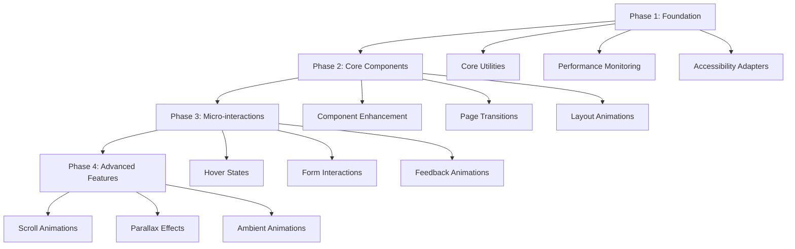

# Bistro Bert Animation System Architecture

## Executive Summary

This document outlines a comprehensive animation system architecture for Bistro Bert, designed to create a cohesive, performant, and accessible animation experience that enhances the luxury dining brand. The system builds upon the existing Framer Motion foundation while standardizing animations across the application.

## 1. Animation Design System

### 1.1 Timing Standards

```typescript
// Animation durations in milliseconds
export const ANIMATION_DURATIONS = {
  // Micro-interactions
  instant: 150,      // Button hover, quick feedback
  fast: 250,         // Simple transitions
  normal: 400,       // Standard UI transitions
  
  // Content animations
  content: 600,      // Text reveals, simple content
  showcase: 800,     // Image reveals, featured content
  
  // Page transitions
  page: 1000,        // Full page transitions
  immersive: 1200,   // Hero section, major experiences
  
  // Ambient animations
  ambient: 3000,     // Background effects, floating elements
  breathing: 4000,   // Subtle ambient cycles
} as const;
```

### 1.2 Easing Functions

```typescript
// Luxury-themed easing curves
export const EASING = {
  // Subtle and refined
  luxury: [0.22, 1, 0.36, 1],      // Smooth, elegant entrance
  refined: [0.25, 0.46, 0.45, 0.94], // Gentle, sophisticated
  
  // Natural movement
  natural: [0.4, 0, 0.2, 1],       // Organic feel
  graceful: [0.23, 1, 0.32, 1],    // Flowing, elegant
  
  // Interactive elements
  responsive: [0.175, 0.885, 0.32, 1.275], // Slight overshoot for feedback
  subtle: [0.215, 0.61, 0.355, 1],      // Gentle response
  
  // Special effects
  shimmer: [0.11, 0, 0.5, 0],        // Gold accent animations
  float: [0.45, 0.05, 0.55, 0.95],    // Floating elements
} as const;
```

### 1.3 Animation Categories

#### Entrance Animations
- **Fade In**: Opacity transitions for content appearance
- **Slide In**: Directional reveals for panels and menus
- **Scale In**: Growing elements for emphasis
- **Unfold**: Elegant reveals for complex content
- **Elegant Reveal**: Multi-stage reveals for luxury presentation

#### Exit Animations
- **Fade Out**: Subtle content dismissal
- **Slide Out**: Directional element dismissal
- **Scale Down**: Shrinking elements for hierarchy
- **Collapse**: Content folding animations
- **Graceful Exit**: Multi-stage dismissal

#### Micro-interactions
- **Hover States**: Button and link enhancements
- **Focus States**: Accessibility-focused interactions
- **Loading States**: Progress and waiting indicators
- **Success States**: Confirmation animations
- **Error States**: Gentle error feedback

#### State Changes
- **Toggle Animations**: On/off state transitions
- **Selection States**: Item selection feedback
- **Expansion**: Accordion and expandable content
- **Filter Changes**: Content filtering transitions
- **Data Updates**: Dynamic content changes

## 2. Architecture Components

### 2.1 Core Animation Utilities

```typescript
// src/lib/animation/core.ts
import { motion, MotionProps, Variants } from 'framer-motion';
import { ANIMATION_DURATIONS, EASING } from './constants';

export interface AnimationConfig {
  duration?: number;
  ease?: number[] | string;
  delay?: number;
  repeat?: number | boolean;
  repeatType?: 'loop' | 'reverse' | 'mirror';
}

export interface ResponsiveAnimationConfig {
  mobile: AnimationConfig;
  tablet: AnimationConfig;
  desktop: AnimationConfig;
}

export class AnimationEngine {
  // Standardized animation factory
  static createAnimation(config: AnimationConfig): MotionProps {
    return {
      transition: {
        duration: config.duration || ANIMATION_DURATIONS.normal,
        ease: config.ease || EASING.luxury,
        delay: config.delay || 0,
      },
    };
  }

  // Responsive animation configuration
  static createResponsiveAnimation(config: ResponsiveAnimationConfig): MotionProps {
    // Implementation for responsive animations
  }

  // Performance-optimized animations
  static createOptimizedAnimation(config: AnimationConfig): MotionProps {
    return {
      transition: {
        duration: config.duration || ANIMATION_DURATIONS.normal,
        ease: config.ease || EASING.luxury,
        delay: config.delay || 0,
        type: 'tween',
      },
      // Hardware acceleration hints
      style: {
        willChange: 'transform, opacity',
      },
    };
  }
}
```

### 2.2 Animation Presets

```typescript
// src/lib/animation/presets.ts
import { Variants } from 'framer-motion';

export const PRESETS = {
  // Content reveals
  fadeIn: {
    initial: { opacity: 0 },
    animate: { opacity: 1 },
    exit: { opacity: 0 },
  },
  
  slideUp: {
    initial: { opacity: 0, y: 30 },
    animate: { opacity: 1, y: 0 },
    exit: { opacity: 0, y: -30 },
  },
  
  slideLeft: {
    initial: { opacity: 0, x: 30 },
    animate: { opacity: 1, x: 0 },
    exit: { opacity: 0, x: -30 },
  },
  
  scaleIn: {
    initial: { opacity: 0, scale: 0.9 },
    animate: { opacity: 1, scale: 1 },
    exit: { opacity: 0, scale: 0.9 },
  },
  
  // Luxury-specific presets
  luxuryReveal: {
    initial: { opacity: 0, y: 20, scale: 0.98 },
    animate: { opacity: 1, y: 0, scale: 1 },
    exit: { opacity: 0, y: -20, scale: 0.98 },
  },
  
  goldShimmer: {
    initial: { opacity: 0, x: -100 },
    animate: { opacity: 1, x: 100 },
    exit: { opacity: 0, x: 100 },
  },
  
  // Micro-interactions
  hoverLift: {
    whileHover: { y: -4, scale: 1.02 },
    whileTap: { scale: 0.98 },
  },
  
  focusGlow: {
    whileFocus: { scale: 1.02, boxShadow: '0 0 20px rgba(212, 175, 55, 0.3)' },
  },
} as const;
```

### 2.3 Performance Monitoring System

```typescript
// src/lib/animation/performance.ts
export class AnimationPerformanceMonitor {
  private static instance: AnimationPerformanceMonitor;
  private metrics: Map<string, number[]> = new Map();
  private observers: PerformanceObserver[] = [];
  
  static getInstance(): AnimationPerformanceMonitor {
    if (!AnimationPerformanceMonitor.instance) {
      AnimationPerformanceMonitor.instance = new AnimationPerformanceMonitor();
    }
    return AnimationPerformanceMonitor.instance;
  }
  
  // Monitor animation performance
  startMonitoring(animationName: string): void {
    // Start performance monitoring for specific animation
  }
  
  stopMonitoring(animationName: string): number {
    // Stop monitoring and return performance metrics
  }
  
  // Get performance insights
  getInsights(): PerformanceInsights {
    return {
      averageFrameRate: this.calculateAverageFrameRate(),
      slowAnimations: this.getSlowAnimations(),
      recommendations: this.generateRecommendations(),
    };
  }
  
  private calculateAverageFrameRate(): number {
    // Calculate average frame rate across animations
  }
  
  private getSlowAnimations(): string[] {
    // Identify animations dropping below 60fps
  }
  
  private generateRecommendations(): string[] {
    // Generate performance optimization recommendations
  }
}

interface PerformanceInsights {
  averageFrameRate: number;
  slowAnimations: string[];
  recommendations: string[];
}
```

### 2.4 Accessibility Considerations

```typescript
// src/lib/animation/accessibility.ts
import { useAccessibilityPreferences } from '@/utils/accessibility';

export class AccessibilityAnimationAdapter {
  static adaptAnimation(baseAnimation: any, context: string): any {
    const { reducedMotion, highContrast } = useAccessibilityPreferences();
    
    if (reducedMotion) {
      return this.createReducedMotionVariant(baseAnimation);
    }
    
    if (highContrast) {
      return this.createHighContrastVariant(baseAnimation);
    }
    
    return baseAnimation;
  }
  
  private static createReducedMotionVariant(baseAnimation: any): any {
    return {
      ...baseAnimation,
      transition: { duration: 0.01 },
      whileHover: undefined,
      whileTap: undefined,
    };
  }
  
  private static createHighContrastVariant(baseAnimation: any): any {
    return {
      ...baseAnimation,
      style: {
        ...baseAnimation.style,
        border: '2px solid currentColor',
      },
    };
  }
}
```

## 3. Implementation Strategy

### 3.1 Priority Order

#### Phase 1: Foundation (Week 1-2)
1. Create core animation utilities and constants
2. Implement performance monitoring system
3. Establish accessibility adapters
4. Create basic animation presets

#### Phase 2: Core Components (Week 3-4)
1. Enhance existing components with standardized animations
2. Implement page transition system
3. Create animated layout components
4. Add loading and state animations

#### Phase 3: Micro-interactions (Week 5-6)
1. Implement hover and focus states
2. Add form interaction animations
3. Create feedback animations
4. Enhance navigation interactions

#### Phase 4: Advanced Features (Week 7-8)
1. Implement scroll-based animations
2. Add parallax effects
3. Create ambient animations
4. Optimize performance across all animations

### 3.2 Integration Points

#### Existing Components
- `AccessibleMotion.tsx` - Enhance with standardized presets
- `AnimatedButton.tsx` - Add luxury micro-interactions
- `PageTransition.tsx` - Implement standardized page transitions
- `ScrollEffects.tsx` - Enhance with performance optimizations
- `Cursor.tsx` - Add luxury cursor animations

#### Navigation Components
- `LuxuryNavbar.tsx` - Standardize menu animations
- `Header.tsx` - Enhance scroll-based animations
- `MinimalistMenuButton.tsx` - Add refined interaction states

#### Content Components
- `LuxuryMenu.tsx` - Implement elegant menu reveal animations
- `LuxuryContactForm.tsx` - Add form interaction feedback
- `ImageGallery.tsx` - Enhance with luxury transitions

## 4. Performance Guidelines

### 4.1 Maintaining 60fps

```typescript
// Performance optimization techniques
export const PERFORMANCE_GUIDELINES = {
  // Use transform and opacity for animations
  preferredProperties: ['transform', 'opacity'],
  
  // Avoid layout-triggering properties
  avoidedProperties: ['width', 'height', 'left', 'top', 'margin', 'padding'],
  
  // Hardware acceleration hints
  accelerationHints: {
    willChange: 'transform, opacity',
    transform3D: true,
  },
  
  // Animation batching
  batchAnimations: true,
  
  // Reduced motion support
  respectReducedMotion: true,
} as const;
```

### 4.2 Hardware Acceleration Techniques

1. **Transform-Based Animations**: Use `transform` instead of position properties
2. **Opacity Transitions**: Use `opacity` for fade effects
3. **Will-Change Hints**: Apply strategically for complex animations
4. **Layer Promotion**: Use `translateZ(0)` for creating new layers
5. **Animation Batching**: Group animations to reduce layout thrashing

### 4.3 Animation Optimization Patterns

```typescript
// Optimized animation patterns
export const OPTIMIZATION_PATTERNS = {
  // Use Framer Motion's optimized animations
  useLayoutAnimations: true,
  
  // Implement intersection observer for lazy animations
  lazyAnimations: true,
  
  // Reduce animation complexity on mobile
  mobileOptimizations: true,
  
  // Use CSS containment where appropriate
  containmentStrategy: 'layout style paint',
} as const;
```

## 5. Micro-interaction Framework

### 5.1 Types of Micro-interactions

#### Feedback Patterns
- **Success Feedback**: Checkmarks, color changes, subtle scale
- **Error Feedback**: Gentle shake, color indication, icon change
- **Loading Feedback**: Elegant spinners, skeleton screens, progress
- **Confirmation Feedback**: Subtle pulse, color transition, icon change

#### State Transitions
- **Toggle States**: Smooth on/off transitions
- **Selection States**: Visual selection feedback
- **Expansion States**: Accordion and expandable content
- **Filter States**: Content filtering animations

#### Interactive Elements
- **Button Interactions**: Hover, press, disabled states
- **Form Elements**: Focus, validation, submission states
- **Navigation Elements**: Menu reveals, dropdown animations
- **Content Elements**: Image reveals, text animations

### 5.2 Implementation Examples

```typescript
// Micro-interaction examples
export const MICRO_INTERACTIONS = {
  // Button hover with luxury feel
  buttonHover: {
    whileHover: { 
      scale: 1.02, 
      y: -2,
      transition: { duration: 250, ease: EASING.refined }
    },
    whileTap: { 
      scale: 0.98,
      transition: { duration: 150, ease: EASING.subtle }
    },
  },
  
  // Form input focus
  inputFocus: {
    whileFocus: { 
      scale: 1.01,
      boxShadow: '0 0 0 1px var(--burgundy)',
      transition: { duration: 200, ease: EASING.responsive }
    },
  },
  
  // Card hover with reveal
  cardHover: {
    whileHover: { 
      y: -8,
      scale: 1.02,
      transition: { duration: 400, ease: EASING.graceful }
    },
  },
  
  // Success feedback
  successFeedback: {
    initial: { scale: 0.8, opacity: 0 },
    animate: { 
      scale: 1, 
      opacity: 1,
      transition: { duration: 300, ease: EASING.responsive }
    },
  },
} as const;
```

## 6. Implementation Roadmap

### 6.1 Development Phases



### 6.2 Testing Strategy

1. **Performance Testing**: Monitor frame rates and animation smoothness
2. **Accessibility Testing**: Verify reduced motion and high contrast support
3. **Cross-Device Testing**: Ensure consistent experience across devices
4. **User Testing**: Gather feedback on animation feel and usability

### 6.3 Success Metrics

- Performance: Maintain 60fps across all animations
- Accessibility: Full support for reduced motion preferences
- Consistency: Unified animation language across the application
- User Experience: Enhanced luxury dining experience without being overwhelming

## 7. Conclusion

This animation system architecture provides a comprehensive foundation for creating sophisticated, performant, and accessible animations for Bistro Bert. By standardizing animations across the application while maintaining the luxury brand aesthetic, we can enhance the user experience without compromising performance or accessibility.

The system is designed to be modular, maintainable, and extensible, allowing for future enhancements while maintaining consistency across the application. The phased implementation approach ensures a smooth transition and allows for testing and refinement at each stage.

## 8. Implementation Notes & Guidelines

### 8.1 Completed Implementation

The animation system has been fully implemented with the following components:

#### Core Animation Utilities
- **Constants** (`src/utils/animations/constants.ts`): Standardized timing, easing, and animation properties
- **Presets** (`src/utils/animations/presets.ts`): Pre-built animation variants for common use cases
- **Accessibility** (`src/utils/animations/accessibility.ts`): Accessibility adapters for reduced motion and high contrast
- **Performance** (`src/utils/animations/performance.ts`): Performance monitoring and optimization utilities
- **Testing** (`src/utils/animations/testing.ts`): Comprehensive testing utilities for animation validation

#### Animation Hooks
- **useAnimationController** (`src/hooks/animations/useAnimationController.ts`): Central animation management
- **usePageTransition** (`src/hooks/animations/usePageTransition.ts`): Page transition management
- **useMicroInteractions** (`src/hooks/animations/useMicroInteractions.ts`): Micro-interaction handling
- **useStaggeredAnimation** (`src/hooks/animations/useStaggeredAnimation.ts`): Staggered animation control
- **useModal** (`src/hooks/animations/useModal.ts`): Modal animation management
- **useDropdown** (`src/hooks/animations/useDropdown.ts`): Dropdown animation and positioning

#### Animation Components
- **PageTransition** (`src/components/ui/PageTransition.tsx`): Standardized page transitions
- **LuxuryPageTransition** (`src/components/ui/LuxuryPageTransition.tsx`): Enhanced luxury page transitions
- **AnimatedButton** (`src/components/ui/AnimatedButton.tsx`): Animated button component
- **MicroInteractions** (`src/components/ui/MicroInteractions.tsx`): Micro-interaction components
- **StaggeredAnimations** (`src/components/ui/StaggeredAnimations.tsx`): Staggered animation components
- **LuxuryModal** (`src/components/ui/LuxuryModal.tsx`): Luxury modal with animations
- **LuxuryDropdown** (`src/components/ui/LuxuryDropdown.tsx`): Luxury dropdown with animations
- **AnimationTestSuite** (`src/components/ui/AnimationTestSuite.tsx`): Comprehensive testing interface
- **AnimationDemo** (`src/components/ui/AnimationDemo.tsx`): Interactive demo with controls

### 8.2 Testing Infrastructure

#### Test Pages
- **Transitions Test** (`src/app/transitions-test/page.tsx`): Page transition testing
- **Micro-interactions Test** (`src/app/micro-interactions-test/page.tsx`): Micro-interaction validation
- **Staggered Animations Test** (`src/app/staggered-animations-test/page.tsx`): Staggered animation testing
- **Modal/Dropdown Test** (`src/app/modal-dropdown-test/page.tsx`): Modal and dropdown animation testing

#### Testing Capabilities
- **Performance Testing**: Frame rate monitoring and dropped frame detection
- **Consistency Testing**: Animation property validation across variants
- **Accessibility Testing**: Reduced motion and high contrast support validation
- **Visual Regression Testing**: Animation state comparison and validation

### 8.3 Usage Examples

#### Page Transitions
```typescript
import { usePageTransition } from '@/hooks/animations/usePageTransition'
import { LuxuryPageTransition } from '@/components/ui/LuxuryPageTransition'

function App() {
  const { transitionProps, currentTransition } = usePageTransition({
    defaultTransition: 'luxury-reveal',
    routeTransitions: {
      '/menu': 'gold-shimmer',
      '/contact': 'immersive'
    }
  })

  return (
    <LuxuryPageTransition {...transitionProps}>
      <PageContent />
    </LuxuryPageTransition>
  )
}
```

#### Staggered Animations
```typescript
import { StaggeredContainer } from '@/components/ui/StaggeredAnimations'

function MenuItems() {
  return (
    <StaggeredContainer
      direction="up"
      staggerDelay={100}
      triggerOnScroll
    >
      {menuItems.map((item, index) => (
        <MenuItem key={index} {...item} />
      ))}
    </StaggeredContainer>
  )
}
```

#### Modal with Animations
```typescript
import { LuxuryModal } from '@/components/ui/LuxuryModal'

function ContactModal() {
  const [isOpen, setIsOpen] = useState(false)

  return (
    <LuxuryModal
      isOpen={isOpen}
      onClose={() => setIsOpen(false)}
      variant="elegant"
      size="medium"
      showBackdrop
      closeOnBackdrop
      enablePerformanceMonitoring
    >
      <ContactForm />
    </LuxuryModal>
  )
}
```

### 8.4 Performance Optimization Guidelines

#### Animation Best Practices
1. **Use Transform and Opacity**: These properties are GPU-accelerated and don't trigger layout recalculations
2. **Avoid Layout Properties**: Properties like `width`, `height`, `margin`, and `padding` trigger expensive layout recalculations
3. **Apply Hardware Acceleration**: Use `will-change: transform, opacity` strategically for complex animations
4. **Implement Lazy Loading**: Use Intersection Observer to trigger animations only when elements are visible
5. **Reduce Animation Complexity**: Simplify animations on lower-end devices

#### Performance Monitoring
```typescript
import { performanceMonitor } from '@/utils/animations/performance'

// Start monitoring an animation
performanceMonitor.startMonitoring('animation-name', 'priority')

// Stop monitoring and get metrics
const metrics = performanceMonitor.stopMonitoring('animation-name')

// Check performance
if (metrics.frameRate < 30) {
  console.warn('Low frame rate detected:', metrics)
}
```

#### Device-Specific Optimizations
```typescript
import { PerformanceOptimizer } from '@/utils/animations/performance'

// Optimize animations for current device
const optimizedConfig = PerformanceOptimizer.optimizeForDevice({
  duration: 600,
  complexity: 5
})

// Use optimized configuration
<motion.div
  transition={{ duration: optimizedConfig.duration }}
  animate={optimizedConfig.reducedMotion ? { opacity: 1 } : { opacity: 1, y: 0 }}
>
  Content
</motion.div>
```

### 8.5 Accessibility Considerations

#### Reduced Motion Support
```typescript
import { createSafeAnimationProps } from '@/utils/animations/accessibility'

// Create accessibility-safe animation props
const safeProps = createSafeAnimationProps(
  { variants: animationVariants },
  { respectReducedMotion: true }
)

// Use in component
<motion.div {...safeProps}>
  Content
</motion.div>
```

#### Focus Management
```typescript
// Ensure proper focus management in modals
useEffect(() => {
  if (isOpen && modalRef.current) {
    // Focus first focusable element
    const focusableElements = modalRef.current.querySelectorAll(
      'button, [href], input, select, textarea, [tabindex]:not([tabindex="-1"])'
    )
    
    if (focusableElements.length > 0) {
      (focusableElements[0] as HTMLElement).focus()
    }
  }
}, [isOpen])
```

### 8.6 Testing Guidelines

#### Performance Testing
```typescript
import { testAnimationPerformance } from '@/utils/animations/testing'

// Test animation performance
const results = await testAnimationPerformance('animation-name', async () => {
  // Perform animation
  await performAnimation()
})

// Check results
if (results.averageFrameRate < 55) {
  console.warn('Animation performance below optimal:', results)
}
```

#### Consistency Testing
```typescript
import { testAnimationConsistency } from '@/utils/animations/testing'

// Test animation consistency
const results = await testAnimationConsistency(
  'animation-group',
  animationVariants,
  ['opacity', 'transition']
)

// Validate consistency
if (!results.isConsistent) {
  console.warn('Animation inconsistencies found:', results.issues)
}
```

### 8.7 Troubleshooting Common Issues

#### Low Frame Rate
1. Check for layout-triggering properties
2. Reduce animation complexity
3. Implement hardware acceleration
4. Use `will-change` property strategically
5. Consider reducing animation duration

#### Animation Jank
1. Ensure animations use transform and opacity
2. Avoid simultaneous animations on many elements
3. Implement proper cleanup in useEffect
4. Use React.memo to prevent unnecessary re-renders

#### Accessibility Issues
1. Test with reduced motion preferences
2. Ensure proper focus management
3. Add appropriate ARIA labels
4. Test with screen readers

#### Performance on Mobile
1. Reduce animation complexity on smaller screens
2. Use touch-friendly interaction areas
3. Implement proper touch event handling
4. Test on actual devices, not just emulators

### 8.8 Future Enhancements

#### Planned Improvements
1. **Advanced Scroll Animations**: Parallax effects and scroll-triggered animations
2. **Gesture Animations**: Swipe and pinch gesture animations
3. **Physics-Based Animations**: Spring physics and natural movement
4. **Animation State Management**: Global animation state management
5. **Animation Analytics**: User interaction tracking and optimization

#### Extension Points
1. **Custom Animation Presets**: Easy creation of brand-specific animations
2. **Plugin System**: Extensible animation system for third-party integrations
3. **Animation Builder**: Visual tool for creating custom animations
4. **Performance Dashboard**: Real-time performance monitoring interface

This comprehensive implementation provides a solid foundation for sophisticated animations while maintaining performance and accessibility standards. The testing infrastructure ensures consistent quality across all animation implementations.